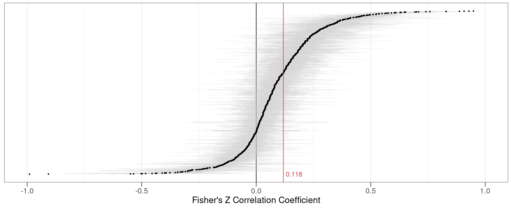

---

##### Download

+ [Paper](ajps2023.pdf)
+ [Appendix](ajps2023suppl.pdf)
+ [Shiny App](https://ameliegodefroidt.shinyapps.io/terrorism-attitudes-metaanalysis/)
+ [Replication Package](https://dataverse.harvard.edu/dataset.xhtml?persistentId=doi:10.7910/DVN/K4L5YI)

---

##### Abstract

How does terrorism affect citizens’ political attitudes? Over the years, many scholars have tried to answer this question. This article performs a meta-analysis on this literature, reviewing about 325 studies conducted between 1985 and 2020 on more than 400,000 respondents. The findings confirm that terrorism is associated—to a small but significant extent—with outgroup hostility, political conservatism and rally-‘round-the-flag effects. At the same time, the effects of terrorism vary widely, with studies on Islamist violence, conducted in the United States or Israel, and using cross-sectional data yielding stronger results on average. Finally, the review reveals remaining gaps in this field of study, including a lack of research on non-Islamist violence or conducted in non-Western contexts. Taken together, this meta-analysis consolidates existing evidence, determines which results hold across contexts, and identifies key gaps in our current knowledge. Its data can also be accessed interactively via a Shiny App.

---

##### Figure: Meta-Analytic Evidence



---

##### Citation

Godefroidt, Amélie. 2023. "How Terrorism Does (and Does Not) Affect Citizens’ Political Attitudes: A Meta-Analysis." *American Journal of Political Science* 67(1): 22–38. https://doi.org/10.1111/ajps.12692

```BibTeX
@article{Godefroidt2023,
  author = {Godefroidt, Amélie},
  year = {2023},
  title ={How Terrorism Does (and Does Not) Affect Citizens’ Political Attitudes: A Meta-Analysis},
  journal = {American Journal of Political Science},
  volume = {67},
  number = {1},
  pages = {22--38},
  doi = {10.1111/ajps.12692},
  url = {https://onlinelibrary.wiley.com/doi/full/10.1111/ajps.12692}
}
```
