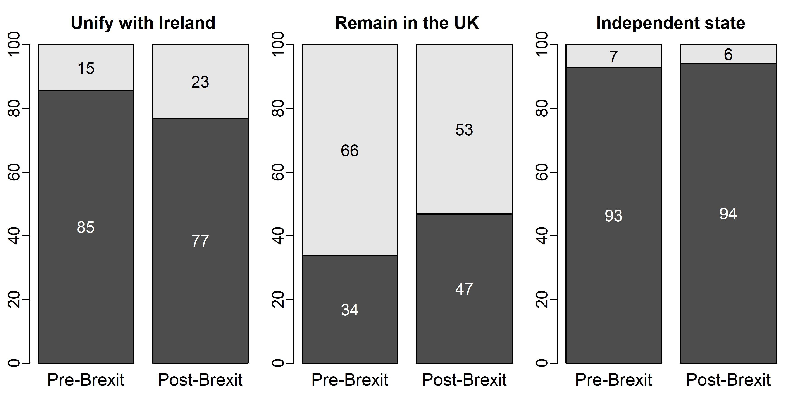

---

##### Download

+ [Paper](jepop2023.pdf)

---

##### Abstract

The UK’s decision to leave the European Union has raised questions about whether Brexit might bring “the Troubles” back to Northern Ireland. We exploit the timing of a unique survey to examine how the EU referendum campaign and its outcome shaped perceptions about the past conflict and preferences for the future in Northern Ireland. The survey reveals that, after the Leave vote, people were more likely to perceive the partitioning of the Island of Ireland and illegitimate rule of Westminster as important conflict causes. Respondents surveyed after the referendum were also more likely to see reunification with Ireland as desirable, and changes in conflict perceptions contributed to this change in preferences for the future. At the same time, public responses seem to be the result of a gradual change during the _campaign_ rather than a shock effect to the _outcome_, and effects decay quickly. These findings contribute to a better understanding of the micro-foundations driving post-Brexit public opinion in Northern Ireland and the potential consequences of holding contentious referendums more generally.

---

##### Figure: Brexit and Attitudes in Northern Ireland



---

##### Citation

Godefroidt, Amélie, Karin Dyrstad, and Kristin Bakke. 2023. "The Past, Brexit, and the Future in Northern Ireland: A Quasi-Natural Experiment." *Journal of Elections, Public Opinion and Parties* 33(1): 149–161. https://doi.org/10.1080/17457289.2022.2090951

```BibTeX
@article{GodefroidtDyrstadBakke2023,
  author = {Godefroidt, Amélie and Dyrstad, Karin and Bakke, Kristin},
  year = {2023},
  title ={The Past, Brexit, and the Future in Northern Ireland: A Quasi-Natural Experiment},
  journal = {Journal of Elections, Public Opinion and Parties},
  volume = {33},
  number = {1},
  pages = {149--161},
  doi = {10.1080/17457289.2022.2090951},
  url = {https://doi.org/10.1080/17457289.2022.2090951}
}
```


