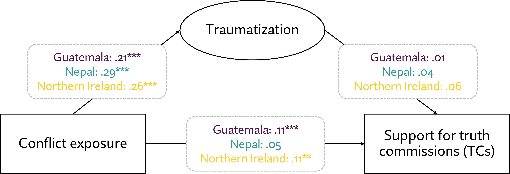

---

##### Download

+ [Paper](cmps2025.pdf)
+ [Appendix](cmps2025suppl.pdf)
+ [Replication Package](https://doi.org/10.7910/DVN/GK4FCA)

---

##### Abstract

Truth commissions (TCs) are a much-discussed and sometimes controversial means of establishing sustainable peace. Despite their prevalence and potential, the determinants of public support for TCs, particularly the role of conflict exposure, remain poorly understood. We suggest trauma as a key mechanism through which conflict exposure affects support for TCs. Trauma may lead victims to see TCs as hurting or healing, respectively, which may decrease or increase support. We test these competing hypotheses across Nepal, Guatemala, and Northern Ireland; three post-conflict cases with differing truth-seeking experiences. While conflict exposure predicts trauma in all three cases, trauma only determines support for TCs with tangible implications, and only in Nepal and Northern Ireland. By qualitatively examining context-specific scope conditions, we propose that the prospective closure utility of a specific TC could bolster its support. Future research is needed to probe the validity of this novel theoretical construct.

---

##### Figure: Support for Truth Commissions



---

##### Citation

Godefroidt, Amélie, and Karin Dyrstad. 2025. "Hurting or Healing? How Conflict Exposure and Trauma (Do Not) Shape Support for Truth Commissions." *Conflict Management and Peace Science* 42(5): 514-535. https://doi.org/10.1177/07388942241285609

```BibTeX
@article{GodefroidtDyrstad2024,
  author = {Godefroidt, Amélie and Dyrstad, Karin},
  year = {2025},
  title ={Hurting or Healing? How Conflict Exposure and Trauma (Do Not) Shape Support for Truth Commissions},
  journal = {Conflict Management and Peace Science},
  volume = {42},
  number = {5},
  pages = {514--535},
  doi = {10.1177/07388942241285609},
  url = {https://doi.org/10.1177/07388942241285609}
}
```
