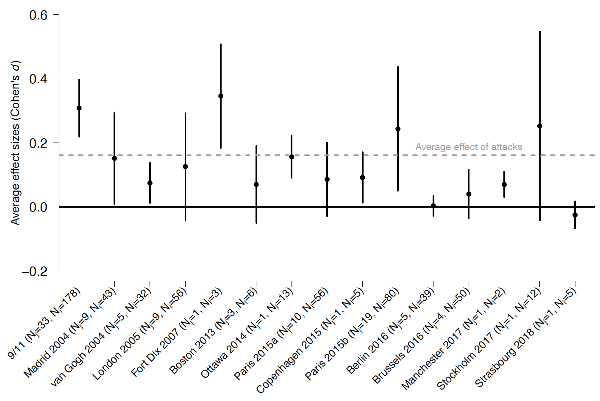

---

##### Download

+ [Paper](2026_ejpr.pdf)
+ [Appendix](2026_ejpr_suppl.pdf)
+ [Replication Package](https://doi.org/10.7910/DVN/ALYGQS)

---

##### Abstract

Recent literature suggests that citizens in Western democracies have become desensitized to Islamist terrorism and that Islamist attacks therefore no longer evoke the same changes in political attitudes as before. However, this hypothesis remains undertheorized and has not been systematically tested. We develop a theoretical framework that positions desensitization alongside alternative trajectories of public responsiveness and subject it to two complementary tests. In Study 1, we draw on a meta-analytic dataset of over 170 previous studies and 800 effect estimates to assess whether public reactions to Islamist terrorism have changed as a result of repeated exposure. In Study 2, we conduct a more controlled comparison of the effects of two recent Islamist terrorist attacks using a comparable research design and a new data source. Across both studies, we find little evidence that responsiveness has systemically diminished – or increased – over time, calling into question the presumed erosion of the effects of Islamist terrorism on political attitudes in Western democracies.

---

##### Figure: Support for Truth Commissions



---

##### Citation

Germann, M., Godefroidt, A., & Mendez, F. (2026). Does Islamist terrorism still affect political attitudes? European Journal of Political Research, 1–21. doi:10.1017/S1475676526101017

```BibTeX
@article{
  Germann_Godefroidt_Mendez_2026,
  author={Germann, Micha and Godefroidt, Amélie and Mendez, Fernando}, 
  title={Does Islamist terrorism still affect political attitudes?},
  DOI={10.1017/S1475676526101017},
  journal={European Journal of Political Research},
  year={2026},
  pages={1–21}}
```
