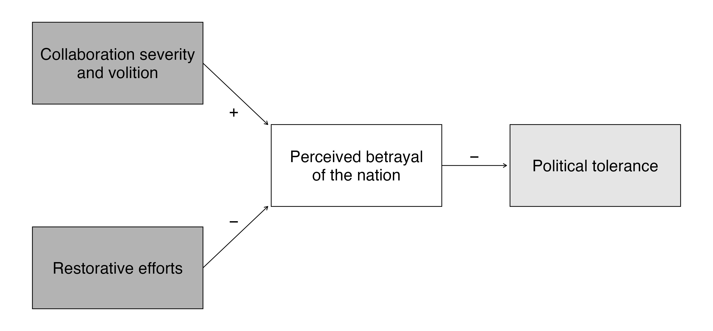

---

##### Download

* [Paper](2026_ajps.pdf)
* [Appendix](2026_ajps_suppl.pdf)
* [Replication Package](https://doi.org/10.7910/DVN/2RJ0XB)

---

##### Abstract

When democracies face existential threats, do citizens uphold the political rights of compatriots who collaborate with the enemy? Using a conjoint experiment with 2,035 Ukrainian citizens during active hostilities, we show how political tolerance hinges on perceived betrayal of the nation. Ideologically motivated collaboration and actions endangering the nation (like passing intelligence to the enemy) elicit severe intolerance, while coerced, survival-based, or administrative actions receive more lenient judgment. At the same time, redemption proves challenging. Concrete efforts like volunteering or reporting enemy war crimes modestly increase tolerance but rarely offset hostility. Worse, symbolic gestures like public apologies backfire, reducing tolerance below the level of legal cooperation. These findings underscore two insights: first, perceived national betrayal emerges as a key moral judgment structuring political intolerance; and second, redemption hinges on substantive contributions to national survival. Together, these insights carry important implications for democratic resilience, conflict resolution, and, eventually, post-conflict reconciliation.

---

##### Figure: Marginal means for the full experiment



---

##### Citation

Daniels, L.-A., & Godefroidt, A. (2026). You Traitor! Collaboration, perceived betrayal, and political tolerance in Ukraine. *American Journal of Political Science*. Forthcoming (pending data verification).

```BibTeX
@article{
  Daniels_Godefroidt_2026,
  author={Daniels, Lesley-Ann and Godefroidt, Amélie},
  title={You Traitor! Collaboration, Perceived Betrayal, and Political Tolerance in Ukraine},
  journal={American Journal of Political Science},
  year={2026},
  note={Forthcoming}}
```
