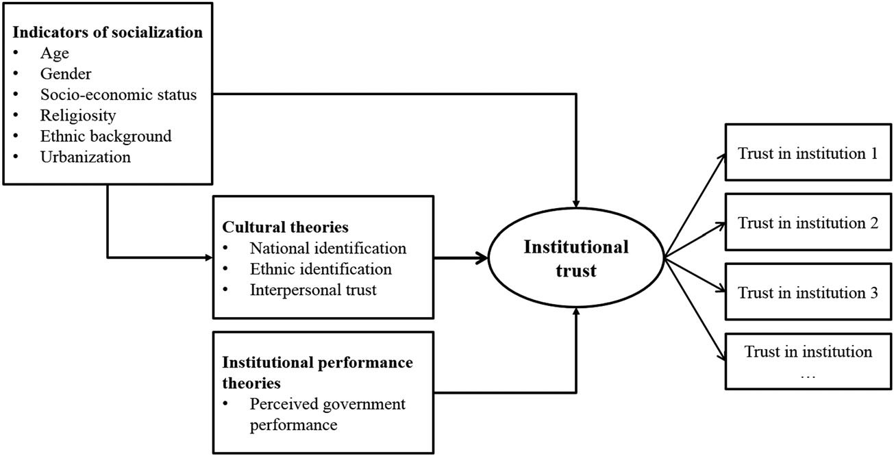

---

##### Download

+ [Paper](2017_democratization.pdf)
  
---

##### Abstract

Political distrust is often widespread in African countries, but the prospects for increasing trust are uncertain given the lack of research on the origins of political trust in the region. Using the 2013 NSS Survey in Ghana and employing hierarchical regression analyses, we develop a model of institutional trust based on insights from both cultural and institutional performance theories. The results clearly support the superiority of institutional performance theories while at the same time providing limited support for cultural explanations. National pride, however, does also substantially encourage institutional trust. This asks for future, cultural-specific studies on trust-building in developing countries trying to establish working institutions using more representative, cross-national, and longitudinal data.

---

##### Figure: Explaining Political Trust in Ghana



---

##### Citation

Godefroidt, Amélie, Arnim Langer, and Bart Meuleman. 2017. "Developing Political Trust in a Developing Country: The Impact of Institutional and Cultural Factors on Political Trust in Ghana." *Democratization* 24(6): 906–928. https://doi.org/10.1080/13510347.2016.1248416

```BibTeX
@article{GodefroidtLangerMeuleman2017,
  author = {Godefroidt, Amélie and Langer, Arnim and Meuleman, Bart},
  year = {2017},
  title = {Developing Political Trust in a Developing Country: The Impact of Institutional and Cultural Factors on Political Trust in Ghana},
  journal = {Democratization},
  volume = {24},
  number = {6},
  pages = {906--928},
  doi = {10.1080/13510347.2016.1248416},
  url = {https://doi.org/10.1080/13510347.2016.1248416}
}

