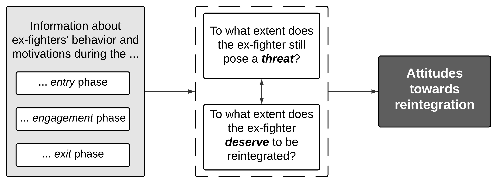

---

##### Download

+ [Paper](jpr2023.pdf)
+ [Appendix](jpr2023suppl.pdf)
+ [Code and data](https://cdn.cloud.prio.org/files/e86529e7-f764-4515-8d55-d337339c86f3/GodefroidtLanger_2021_ReplicationFiles_final.zip)
  
---

##### Abstract

Reintegrating ex-combatants back into society is one of the most challenging, yet fundamental components to building sustainable peace. While previous work has extensively evaluated the reintegration trajectories of ex-combatants, there is still little understanding of how citizens think about reintegration. In this article, we systematically analyze which former fighters people prefer to reintegrate into society. Based on theories of threat and justice, we develop a heuristic framework that explains how information about the motivations and behavior of ex-combatants shapes public preferences about whom to reintegrate. We test this framework using a conjoint experiment conducted among approximately 2,000 (former) university students in Nigeria. We find that our respondents are more forgiving towards former fighters who were forced to join the insurgency and expressed remorse afterwards, while being less willing to reintegrate more militant and less repentant offenders. Similar informational cues shape respondents’ evaluations of how successful the reintegration process would be and what punishment would be appropriate. Taken together, the results underscore the importance of perceptions of risk and fairness in driving attitudes towards reintegration. Finally, subgroup analyses revealed that these heuristics are broadly held across different demographic and conflict-related fault lines. While caution is warranted when generalizing these results, insights gained in this specific context are nonetheless an important step towards advancing our understanding of reintegration processes in conflict-affected countries.

---

##### Figure: Reintegration Preferences



---

##### Citation

Godefroidt, Amélie, and Arnim Langer. 2023. "What Drives Attitudes Towards the Reintegration of Former Fighters? Insights from a Conjoint Experiment in Nigeria." *Journal of Peace Research* 60(3): 410–427. https://doi.org/10.1177/00223433221087070

```BibTeX
@article{GodefroidtLanger2023,
  author = {Godefroidt, Amélie and Langer, Arnim},
  year = {2023},
  title ={What Drives Attitudes Towards the Reintegration of Former Fighters? Insights from a Conjoint Experiment in Nigeria},
  journal = {Journal of Peace Research},
  volume = {60},
  number = {3},
  pages = {410--427},
  doi = {10.1177/00223433221087070},
  url = {https://doi.org/10.1177/00223433221087070}
}
```

