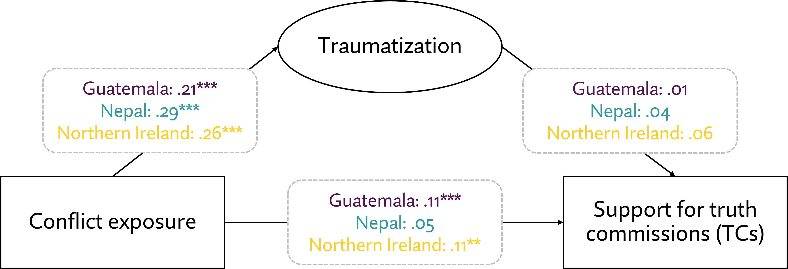

---

##### Download

+ [Paper](cmps2025.pdf)

---

##### Abstract

Truth commissions are widely used transitional justice mechanisms, yet public support for them is not guaranteed. Existing research often assumes that conflict exposure and trauma make individuals more supportive of such mechanisms. Using survey data, this article finds that neither exposure nor trauma straightforwardly predicts support for truth commissions. Instead, the findings highlight the need for more nuanced accounts of how personal experiences with violence interact with broader political and social dynamics.

---

##### Figure: Support for Truth Commissions



---

##### Citation

Godefroidt, Amélie, and Karin Dyrstad. 2024. "Hurting or Healing? How Conflict Exposure and Trauma (Do Not) Shape Support for Truth Commissions." *Conflict Management and Peace Science*. Online first. https://doi.org/10.1177/07388942241285609

```BibTeX
@article{GodefroidtDyrstad2024,
  author = {Godefroidt, Amélie and Dyrstad, Karin},
  year = {2024},
  title ={Hurting or Healing? How Conflict Exposure and Trauma (Do Not) Shape Support for Truth Commissions},
  journal = {Conflict Management and Peace Science},
  doi = {10.1177/07388942241285609},
  url = {https://doi.org/10.1177/07388942241285609}
}
```
