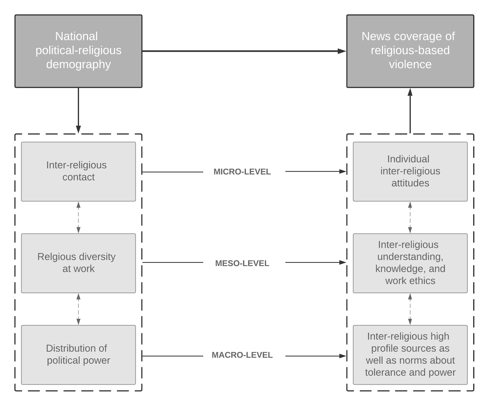

---

##### Download

+ [Paper](joc2020.pdf)
+ [Appendix](joc2020suppl.pdf)
+ [Replication Package](joc2020.pdf)
    
---

##### Abstract

Recent studies on conflict and terrorism news coverage have documented an ingroup bias as well as an increasingly negative discourse about Muslims in the wake of Islamist terrorist attacks. Yet, as most of these studies have focused on Western media and settings, the determinants of news media’s religious biases and out-group categorizations remain insufficiently understood. In this article, we draw on interviews with Nigerian media practitioners and a comparison of Boko Haram news coverage in two Nigerian newspapers—one Southern-based/Christian-affiliated and one Northern-based/Muslim-affiliated—to argue that it is crucial to consider a country’s political-religious demography in order to understand the way in which religious-based violence is covered in the news. In this respect, we identify micro-, meso- and macro-level theoretical mechanisms through which a country’s demography can promote domestic news outlets—regardless of their background and readership—to cover conflict in a more balanced, nuanced, and objective way.

---

##### Figure: Media Representations of Boko Haram



---

##### Citation

Demarest, Leila, Amélie Godefroidt, and Arnim Langer. 2020. "Understanding News Coverage of Religious-Based Violence: Empirical and Theoretical Insights from Media Representations of Boko Haram in Nigeria." *Journal of Communication* 70(4): 548–573. https://doi.org/10.1093/joc/jqaa011

```BibTeX
@article{DemarestGodefroidtLanger2020,
  author = {Demarest, Leila and Godefroidt, Amélie and Langer, Arnim},
  year = {2020},
  title ={Understanding News Coverage of Religious-Based Violence: Empirical and Theoretical Insights from Media Representations of Boko Haram in Nigeria},
  journal = {Journal of Communication},
  volume = {70},
  number = {4},
  pages = {548--573},
  doi = {10.1093/joc/jqaa011},
  url = {https://doi.org/10.1093/joc/jqaa011}
}
```

